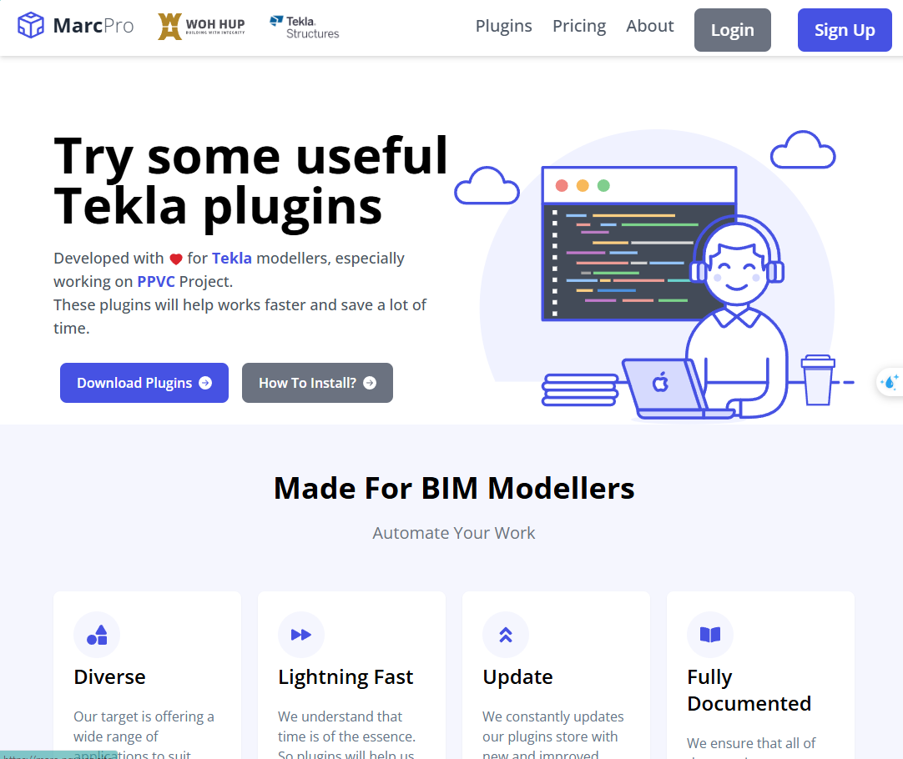

# Tekla Plugins Store

A modern web application for browsing, downloading, and managing Tekla Structures plugins. Built with React, TypeScript, and Tailwind CSS.

## Features

- Browse and search Tekla plugins
- Detailed plugin information and documentation
- User authentication and profiles 
- Plugin upload and management
- Responsive design for all devices

## Screenshots

### Landing Page


### Plugin List


### Plugin Details


### New Plugin Upload


### User Authentication


## Test Accounts

For testing purposes, you can use these accounts:

1. John Smith (Senior BIM Developer)
   - Email: john.smith@example.com
   - Password: test123

## Technologies Used

- React
- TypeScript
- Vite
- Tailwind CSS
- React Router
- React Hook Form
- Yup Validation

## Project Structure

```
src/
├── assets/        # Static assets and data
├── components/    # Reusable UI components
├── dummyData/     # Mock data and authentication
├── hooks/         # Custom React hooks
├── layouts/       # Page layout components
├── pages/         # Application pages
├── store/         # State management
├── types/         # TypeScript type definitions
└── utils/         # Utility functions
```

## Development

- `npm run dev` - Start development server
- `npm run build` - Build for production
- `npm run preview` - Preview production build
